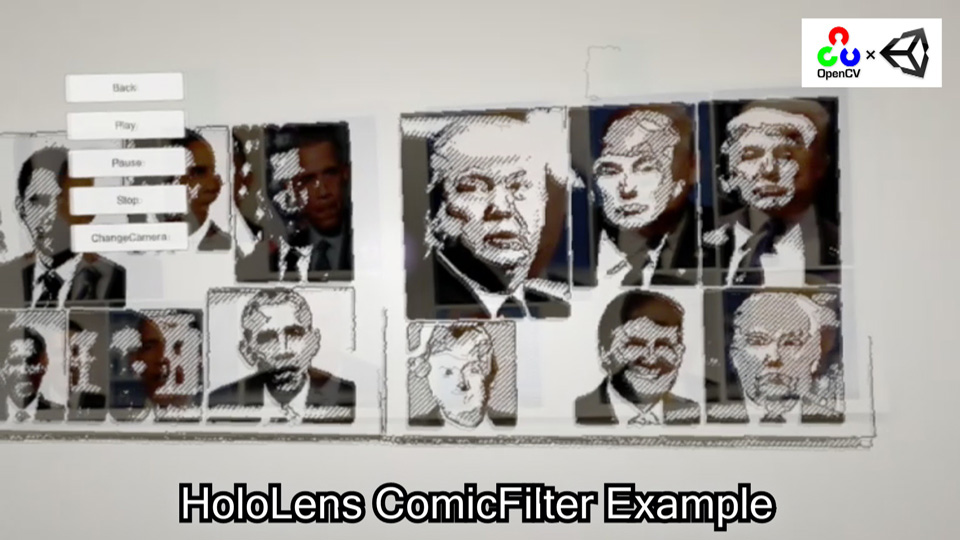

# HoloLens With OpenCVForUnity Example

## What's new
* Performance of ArUco example improved.
* By using the "HoloLensCameraStream" asset, video capture can now be executed faster.

## Demo Video (old version)

## Demo Hololens App
* [HoloLensWithOpenCVForUnityExample.zip](https://github.com/EnoxSoftware/HoloLensWithOpenCVForUnityExample/releases)
* Use the Windows Device Portal to install apps on HoloLens. [https://docs.microsoft.com/en-us/hololens/hololens-install-apps](https://docs.microsoft.com/en-us/hololens/hololens-install-apps)

## Environment
* Hololens (RS4)
* Windows 10 Pro 1803  
* Windows 10 SDK 10.0.17134 
* Visual Studio 2017 (v157.4.0)  
* Unity 2017.4.3f1  
* HoloToolkit-Unity-2017.4.0.0 ([https://github.com/Microsoft/MixedRealityToolkit-Unity/releases](https://github.com/Microsoft/MixedRealityToolkit-Unity/releases))  
* OpenCV for Unity 2.2.9 ([https://assetstore.unity.com/packages/tools/integration/opencv-for-unity-21088](https://assetstore.unity.com/packages/tools/integration/opencv-for-unity-21088))  
* HoloLensCameraStream ([https://github.com/VulcanTechnologies/HoloLensCameraStream](https://github.com/VulcanTechnologies/HoloLensCameraStream))  

## Setup
1. Download the latest release unitypackage. [HoloLensWithOpenCVForUnityExample.unitypackage](https://github.com/EnoxSoftware/HoloLensWithOpenCVForUnityExample/releases)
1. Create a new project. (HoloLensWithOpenCVForUnityExample)
1. Import the HoloToolkit-Unity-2017.4.0.0.unitypackage.
    * Setup the HoloToolKit. (Mixed Reality ToolKit > Configure > Apply Mixed Reality Project Setting)
1. Import the OpenCVForUnity.
    * Setup the OpenCVForUnity. (Tools > OpenCV for Unity > Set Plugin Import Settings)
    * Move the "OpenCVForUnity/StreamingAssets/haarcascade_frontalface_alt.xml" and "OpenCVForUnity/StreamingAssets/lbpcascade_frontalface.xml" to the "Assets/StreamingAssets/" folder.
1. Clone HoloLensCameraStream repository.
    * Copy the "HoloLensCameraStream/HoloLensVideoCaptureExample/Assets/CamStream/" folder to the "Assets/" folder.
1. Import the HoloLensWithOpenCVForUnityExample.unitypackage.
1. Add the "Assets/HoloLensWithOpenCVForUnityExample/*.unity" files to the "Scenes In Build" list in the "Build Settings" window.
1. Set ".NET" to "Other Settings > Configuration > Scripting Backend" selector in the "Player Settings" window. (HoloLensCameraStream doesn't support IL2CPP backend)
1. Add "WebCam" to "Publishing Settings > Capabilities" checklist in the "Player Settings" window.
1. Build and Deploy to HoloLens. (See [https://developer.microsoft.com/en-us/windows/holographic/holograms_100](https://developer.microsoft.com/en-us/windows/holographic/holograms_100))
    *  (Print the AR marker "ArUcoMarker_DICT_6X6_250_ID1.pdf" on an A4 size paper)  

|Assets|Buld Settings|
|---|---|
|||

## ScreenShot (old version)
 

 

 

 

 

